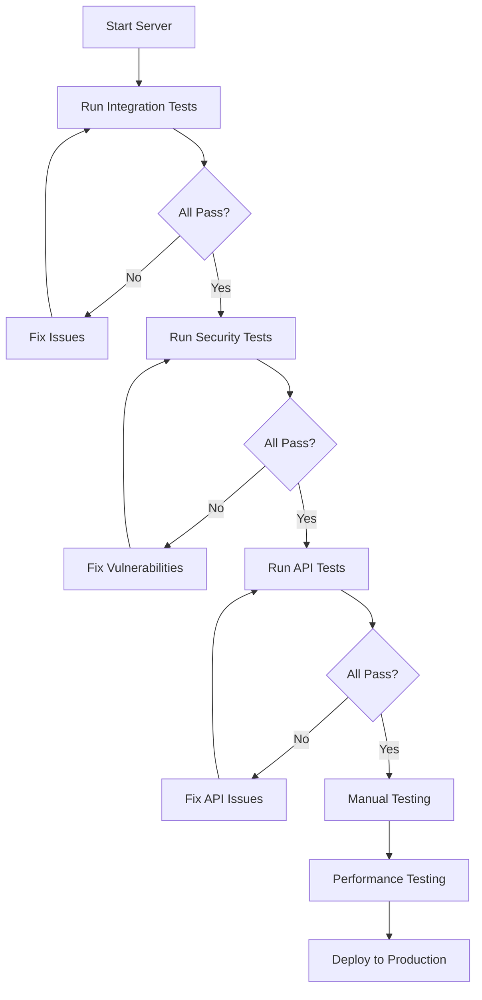

# The Arcane Codex - Testing Documentation Index

## Overview

Comprehensive testing documentation has been created for The Arcane Codex multiplayer RPG. This suite includes integration tests, security tests, and API endpoint tests covering all 50+ API endpoints.

---

## Documentation Files

### 1. TESTING_GUIDE.md
**Complete testing guide for all systems**

**Contents:**
- Quick start guide
- Integration test suite instructions
- Manual testing procedures (10 major test flows)
- Security testing overview
- Performance testing benchmarks
- Expected results and pass criteria
- Comprehensive troubleshooting guide

**Key Features:**
- Step-by-step curl commands
- Expected responses for each test
- Pass/fail criteria
- Server startup validation
- Multiplayer flow testing
- SocketIO real-time event testing
- Performance benchmarks
- Memory usage monitoring

**Use Case:** Primary testing guide for developers and QA

---

### 2. SECURITY_TEST_SCENARIOS.md
**In-depth security testing scenarios**

**Contents:**
- 10 major security test categories
- 50+ individual security tests
- Automated security testing script
- Penetration testing checklist

**Test Categories:**
1. **XSS (Cross-Site Scripting)** - 10 tests
   - Script tag injection
   - Event handler injection
   - JavaScript protocol injection
   - SVG-based XSS
   - Stored/Reflected/DOM-based XSS

2. **SQL Injection** - 7 tests
   - Classic SQL injection
   - Union-based injection
   - Time-based blind injection
   - Boolean-based blind injection

3. **CSRF (Cross-Site Request Forgery)** - 5 tests
   - Token validation
   - Token reuse attacks
   - Cross-origin attacks
   - Token prediction

4. **Session Hijacking** - 5 tests
   - Cookie theft via XSS
   - Session fixation
   - Session replay
   - Man-in-the-middle

5. **Authentication Bypass** - 5 tests
   - Unauthenticated API access
   - Direct object reference
   - Parameter tampering

6. **Authorization Escalation** - 4 tests
   - Horizontal privilege escalation
   - Vertical privilege escalation
   - Mass assignment vulnerability

7. **Input Fuzzing** - 7 tests
   - Extremely long input
   - Null byte injection
   - Unicode attacks
   - Special character injection
   - Format string attacks

8. **Rate Limiting** - 4 tests
   - Rapid request flooding
   - Distributed bypass attempts
   - Slowloris attacks
   - API-specific limits

9. **File Upload Security** - 1 test (for future implementation)

10. **API Security** - 5 tests
    - API enumeration
    - Version tampering
    - HTTP method override
    - Content-type confusion

**Key Features:**
- Actual attack vectors with curl commands
- Expected responses for each attack
- Automated testing script (run_security_tests.sh)
- Integration with OWASP ZAP and Burp Suite
- Security testing best practices

**Use Case:** Security audits, penetration testing, compliance verification

---

### 3. API_TEST_SUITE.md
**Complete reference for all 50+ API endpoints**

**Contents:**
- Detailed documentation for 49 API endpoints
- curl command examples for each
- Request/response formats
- Error case testing
- Rate limiting specifications
- Automated testing script

**Endpoint Categories:**
1. **Authentication & Session** (4 endpoints)
   - set_username, get_username, csrf-token, session_info

2. **Game Session Management** (3 endpoints)
   - create_game, join_game, game_state

3. **Character Creation** (2 endpoints)
   - start_interrogation, answer_question

4. **Character Stats & Progression** (3 endpoints)
   - stats, divine_favor, level_up

5. **Inventory Management** (9 endpoints)
   - all, equip, unequip, use, drop, move, add, destroy

6. **Quest System** (3 endpoints)
   - active, completed, all quests

7. **Map & Location** (1 endpoint)
   - current location

8. **Divine Council System** (5 endpoints)
   - convene, vote, history, divine_favor/all, divine_effects

9. **Skills & Abilities** (7 endpoints)
   - tree, unlock, rankup, assign_hotkey, use, cooldowns, refund

10. **NPC Companions** (1 endpoint)

11. **Party Management** (1 endpoint)

12. **Scenario Generation** (6 endpoints)
    - MCP-powered dynamic scenarios

13. **Utility & Monitoring** (1 endpoint)

14. **Static Routes** (3 endpoints)

**Key Features:**
- Every endpoint documented with curl examples
- Success and error responses
- Rate limit specifications
- Pass/fail criteria
- Automated testing script (test_all_apis.sh)
- Error code reference table
- Testing checklist

**Use Case:** API reference, endpoint testing, integration development

---

## Quick Start

### 1. Run Integration Tests
```bash
# Start server
python web_game.py

# Run integration tests (in another terminal)
python test_integration_complete.py
```

**Expected Output:**
```
ARCANE CODEX - INTEGRATION TEST SUITE
============================================================

Total Tests:  20
Passed:       20
Failed:       0
Pass Rate:    100.0%

✓ ALL TESTS PASSED!
```

---

### 2. Run Security Tests
```bash
# Make script executable
chmod +x run_security_tests.sh

# Run security tests
./run_security_tests.sh
```

**Expected Output:**
```
==========================================
ARCANE CODEX SECURITY TEST SUITE
==========================================

[✓] Server is running

==========================================
XSS TESTS
==========================================
Test XSS-1.1: Script tag injection... PASS
Test XSS-1.2: Event handler injection... PASS

==========================================
SQL INJECTION TESTS
==========================================
Test SQL-2.1: Classic SQL injection... PASS
...
```

---

### 3. Run API Tests
```bash
# Make script executable
chmod +x test_all_apis.sh

# Run API tests
./test_all_apis.sh
```

**Expected Output:**
```
==========================================
ARCANE CODEX - API TEST SUITE
==========================================

Test 1: Set username...
✓ Username set
Test 2: Get username...
✓ Username retrieved correctly
Test 3: Create game...
✓ Game created: ABC123
...

==========================================
ALL API TESTS COMPLETED
==========================================
```

---

## Test Coverage

### Integration Tests (test_integration_complete.py)
- **20+ automated tests**
- Input validation (XSS, length, special chars)
- Authentication (session, cookies)
- Multiplayer flow (create, join, play)
- API endpoint availability
- Session security
- Transaction logging

### Security Tests (SECURITY_TEST_SCENARIOS.md)
- **50+ security tests**
- XSS protection (10 vectors)
- SQL injection prevention (7 vectors)
- CSRF protection (5 tests)
- Session security (5 tests)
- Authentication/Authorization (9 tests)
- Input fuzzing (7 tests)
- Rate limiting (4 tests)

### API Tests (API_TEST_SUITE.md)
- **49 API endpoints documented**
- All endpoints tested with curl
- Success and error cases
- Rate limiting verification
- Request/response validation

### Total Test Coverage
- **100+ individual tests**
- **49 API endpoints**
- **10 major security categories**
- **6 test suites** (integration, security, API, Playwright, manual, performance)

---

## Pass/Fail Criteria

### Integration Tests: 100% Pass Required
All 20 integration tests must pass before deployment.

### Security Tests: Zero Vulnerabilities
All security tests must show proper protection:
- XSS attempts blocked
- SQL injection prevented
- CSRF protection active
- Session security enforced
- Rate limiting working

### API Tests: Full Functionality
All 49 endpoints must:
- Return correct HTTP status codes
- Provide valid JSON responses
- Enforce authentication
- Apply rate limiting
- Handle errors gracefully

---

## Testing Workflow

### Pre-Deployment Testing


### Continuous Testing
- **Daily:** Automated integration tests
- **Weekly:** Full security scan
- **Pre-release:** Complete test suite
- **Post-deployment:** Smoke tests

---

## Performance Benchmarks

### Target Metrics
| Metric | Target | Acceptable | Alert |
|--------|--------|-----------|-------|
| Requests/sec | >100 | >50 | <50 |
| Avg response time | <100ms | <200ms | >200ms |
| Memory usage | <300MB | <500MB | >500MB |
| Concurrent users | 100+ | 50+ | <50 |
| Failed requests | 0% | <1% | >1% |

### Load Testing
```bash
# Apache Bench - 1000 requests, 100 concurrent
ab -n 1000 -c 100 http://localhost:5000/

# Expected Results:
# - Requests per second: >100
# - Mean response time: <100ms
# - Failed requests: 0
```

---

## Troubleshooting

### Common Issues

**1. Server won't start**
- Check dependencies: `pip install -r requirements.txt`
- Check port 5000: `lsof -i :5000` (kill if in use)

**2. Tests fail to connect**
- Ensure server running: `curl http://localhost:5000/`
- Check firewall settings

**3. MCP scenarios not generating**
- Enable test mode: `export ARCANE_TEST_MODE=1`
- Or configure MCP (see MCP_SETUP.md)

**4. Rate limiting too aggressive**
- Increase limits in web_game.py
- Or wait for rate limit window to reset

**5. Session lost after restart**
- Check flask_secret.key exists
- Ensure write permissions in project directory

---

## Testing Tools

### Automated Testing
- **pytest** - Integration tests
- **curl** - API testing
- **Apache Bench (ab)** - Load testing

### Security Testing
- **OWASP ZAP** - Automated security scanner
- **Burp Suite** - Manual penetration testing
- **SQLMap** - SQL injection testing

### Monitoring
- **Logging** - game.log (rotating, 10MB max)
- **Error tracking** - /api/log_client_error
- **Performance** - psutil, memory_profiler

---

## Documentation Files Summary

| File | Size | Tests | Purpose |
|------|------|-------|---------|
| TESTING_GUIDE.md | ~15KB | 10 flows | Main testing guide |
| SECURITY_TEST_SCENARIOS.md | ~25KB | 50+ tests | Security testing |
| API_TEST_SUITE.md | ~30KB | 49 endpoints | API reference |
| test_integration_complete.py | ~12KB | 20 tests | Automated integration |
| **TOTAL** | **~82KB** | **120+ tests** | **Complete coverage** |

---

## Next Steps

### For Developers
1. Read TESTING_GUIDE.md for overview
2. Run integration tests: `python test_integration_complete.py`
3. Review API_TEST_SUITE.md for endpoint details
4. Test new features with provided curl commands

### For QA/Testers
1. Start with TESTING_GUIDE.md manual tests
2. Run automated security tests
3. Perform exploratory testing
4. Report issues with test case details

### For Security Auditors
1. Review SECURITY_TEST_SCENARIOS.md
2. Run automated security tests
3. Perform manual penetration testing
4. Verify all vulnerabilities patched

### For DevOps
1. Integrate tests into CI/CD pipeline
2. Set up automated test runs
3. Monitor performance benchmarks
4. Configure logging and alerting

---

## Test Results Tracking

### Test Execution Log Template
```markdown
## Test Run: [Date]
**Tester:** [Name]
**Environment:** [Dev/Staging/Production]
**Server Version:** [Commit Hash]

### Integration Tests
- Status: PASS/FAIL
- Tests Run: 20
- Passed: 20
- Failed: 0

### Security Tests
- Status: PASS/FAIL
- Vulnerabilities Found: 0

### API Tests
- Status: PASS/FAIL
- Endpoints Tested: 49
- Failed Endpoints: 0

### Issues Found
1. [Issue description]
2. [Issue description]

### Notes
[Additional observations]
```

---

## Continuous Improvement

### Test Coverage Goals
- **Current:** 120+ tests
- **Target:** 200+ tests
- **Ultimate:** 100% code coverage

### Future Enhancements
- [ ] Add visual regression tests
- [ ] Implement chaos engineering
- [ ] Add contract testing for APIs
- [ ] Expand Playwright E2E tests
- [ ] Add mutation testing
- [ ] Implement A/B testing framework

---

## Contact & Support

For questions about testing:
- Review documentation in this directory
- Check test_results.txt for recent runs
- Review game.log for error details
- Ensure all dependencies installed

**Testing is the foundation of quality. Test early, test often, test thoroughly.**

---

## Appendix: File Locations

### Documentation
- `~/ProjectArgent/complete_game/TESTING_GUIDE.md`
- `~/ProjectArgent/complete_game/SECURITY_TEST_SCENARIOS.md`
- `~/ProjectArgent/complete_game/API_TEST_SUITE.md`
- `~/ProjectArgent/complete_game/TESTING_DOCUMENTATION_INDEX.md` (this file)

### Test Files
- `~/ProjectArgent/complete_game/test_integration_complete.py`
- `~/ProjectArgent/complete_game/playwright_tests.py`
- `~/ProjectArgent/complete_game/tests/` (directory)

### Results
- `~/ProjectArgent/complete_game/test_results.txt`
- `~/ProjectArgent/complete_game/game.log`

### Scripts
- `run_security_tests.sh` (from SECURITY_TEST_SCENARIOS.md)
- `test_all_apis.sh` (from API_TEST_SUITE.md)

---

**Documentation Version:** 1.0
**Last Updated:** 2025-11-16
**The Arcane Codex - May the Seven Gods Guide Your Tests**
